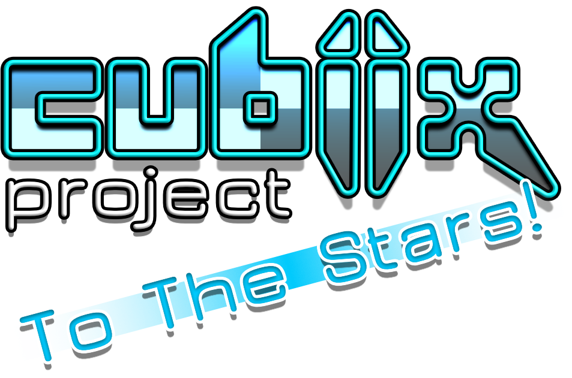

  

## "Cubiix Project: To The Stars!" is an open source Social MMO.

The project is maintained by Duskitten / [Selkspace](https://selkspace.xyz), and is licensed under the [Cubiix Project License](LICENSE.md)

## Instructions

- The project is currently built with the [Godot Engine 4.3](https://godotengine.org/).
- Download and open the project as normal.

## Credits
Credits to external resources used currently in the project:
-  [Godot SQlite](https://github.com/2shady4u/godot-sqlite)
-  [Godot JWT](https://github.com/fenix-hub/godot-engine.jwt/tree/main)
-  [QRCode Generator](https://kenyoni-software.github.io/godot-addons/addons/qr_code/)
-  [TV Boarder Shader (Heavily Modified)](https://godotshaders.com/shader/animated-tv-static-border-shader/)
-  [Glitch Shader](https://godotshaders.com/shader/glitch-effect-shader-for-godot-engine-4/)
-  [GPU Trail](https://github.com/celyk/GPUTrail)
